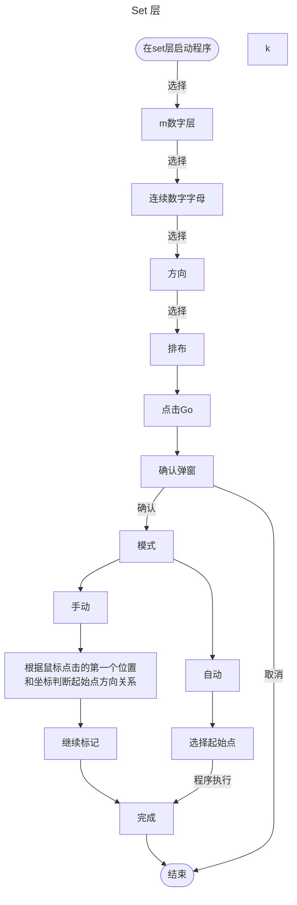
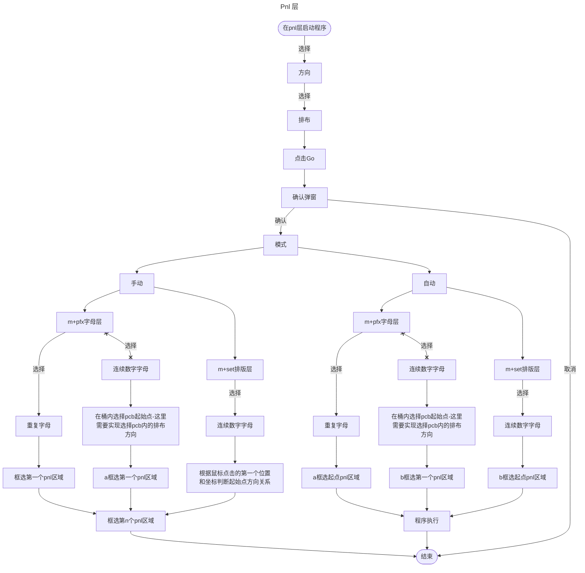

# request.md

mi
123456

umm1b07fr2@yahoohh.asia
tm_713e4f9e472e3a6b3d87978a0cddf1cd9754ce1e398ef98e


1. 监控电磁热熔靶标是否被削   
目的: 	提高制作检查效率   
内容: 	电磁热熔靶标不可以削，削了会影响热熔效果   

已知两项热熔靶标symboles名称为：3e-dcrhq-chang; 3e-dcrhq-duan 分布在不同的layers中,你需要在各个layers中找到这些symbols，并注意在该symbols内有一些surface attr(.geometry=3e-dcrhq)的元素，将该范围本身以及该surface排除后，在**同层layers**中检查是否有其他任何positive,negative的Line,Pad,非attr(.geometry=3e-dcrhq)的surface，text元素放置或者搭在了这个区域内。
如果有搭在这个区域内，弹出提示框列表并使用bloom标记。
创建一个名为DcRhqChk.pm的文件，实现上述功能后放置在film文件夹中。可参考现有代码库代码以贴合目前的代码风格
编写完毕后提示我，我将在incam上自主测试并告知你结果

```mermaid
flowchart TD
    START(["check() 开始"]) --> INIT["解析参数: f, jobname, stepname, Layers"]
    INIT --> DEF_SYM["定义目标 symbol 哈希表<br/>%target_symbols<br/>拆分为: 有 geometry / 无 geometry 两组"]
    DEF_SYM --> DET_LAYERS{"@$layers 是否为空?"}

    DET_LAYERS -->|"否 (HandleCatch 传入了层列表)"| FILT_INPUT["过滤传入层列表<br/>排除 drl, nc*, slot, rout 等非信号层"]
    DET_LAYERS -->|"是 (空)"| FETCH_MATRIX["从矩阵获取所有层名<br/>f->INFO entity_type=matrix"]
    FETCH_MATRIX --> FILT_MATRIX["过滤: 排除非信号层"]

    FILT_INPUT --> CHK_EMPTY{"@check_layers 是否为空?"}
    FILT_MATRIX --> CHK_EMPTY

    CHK_EMPTY -->|"是"| NO_LAYER["返回: 无信号层可检查"]
    CHK_EMPTY -->|"否"| GLOBAL_SETUP["全局设置<br/>units=inch, clear_layers<br/>配置 popup filter"]

    GLOBAL_SETUP --> LAYER_LOOP{"遍历每个层 cur_layer"}

    LAYER_LOOP --> CHK_EXIST{"层是否存在?"}
    CHK_EXIST -->|"否"| SKIP_LAYER["记录: 层不存在, 跳过<br/>next"]
    SKIP_LAYER --> LAYER_LOOP

    CHK_EXIST -->|"是"| SETUP_WORK["设置工作层:<br/>display_layer=$cur_layer<br/>work_layer=$cur_layer"]

    SETUP_WORK --> STEP1["步骤1: 查找目标 symbols<br/>set_filter_symbols + filter_area<br/>get_select_count"]

    STEP1 --> CHK_COUNT{"选中数量 > 0?"}
    CHK_COUNT -->|"否"| NEXT_LAYER["next (该层无目标 symbol)"]
    NEXT_LAYER --> LAYER_LOOP

    CHK_COUNT -->|"是"| STEP1B["步骤1b: 获取原层 feat_index 层级<br/>INFO -d FEATURES -o feat_index+f0<br/>构建 %feat_idx_map (type,x,y → index)<br/>扫描靶标 symbol 行 → target_max_idx"]

    STEP1B --> STEP2["步骤2: 清理临时层<br/>delete_layer tmp_ref / tmp_ref_nogeom / tmp_work"]

    STEP2 --> STEP3["步骤3: 复制选中 symbol 到 tmp_ref<br/>sel_contourize 生成全部 symbol 轮廓<br/>(用于最终违规检测)"]

    STEP3 --> STEP4["步骤4: 复制整层到 tmp_work<br/>copy_layer $cur_layer -> tmp_work"]

    STEP4 --> CHK_NOGEOM{"@no_geom 是否为空?<br/>(配置中无 geometry<br/>的 symbol)"}

    CHK_NOGEOM -->|"否 (存在无 geometry symbol)"| STEP4A["步骤4a: 切回原层, 仅选无 geometry symbol<br/>复制到 tmp_ref_nogeom<br/>sel_contourize 生成轮廓<br/>设置 has_nogeom=1<br/>切回 tmp_work"]
    CHK_NOGEOM -->|"是 (全部有 geometry)"| STEP4B

    STEP4A --> STEP4B["步骤4b: 在 tmp_work 上按名称<br/>删除全部目标 symbol 的 feature<br/>(防止自触发, 仅执行一次)"]

    STEP4B --> STEP5["步骤5: 机制1 — 精确匹配 .geometry 删除<br/>遍历每个 @geom_values:<br/>  选 surface + .geometry=$geom<br/>  sel_delete (不限位置)<br/><i>始终执行, 不受 $has_nogeom 影响</i>"]

    STEP5 --> CHK_HAS_NOGEOM{"has_nogeom == 1?<br/>(本层实际存在<br/>无 geometry 的 symbol)"}

    CHK_HAS_NOGEOM -->|"是"| STEP6["步骤6: 机制2 — cover 模式删除<br/>sel_ref_feat layers=tmp_ref_nogeom<br/>use=filter, mode=cover<br/>选 surface 且有 .geometry 属性<br/>sel_delete (仅轮廓内)"]
    CHK_HAS_NOGEOM -->|"否"| STEP6B

    STEP6 --> STEP6B["步骤6b: 删除板边填充铜皮<br/>选 surface + .pattern_fill<br/>sel_delete"]

    STEP6B --> STEP7["步骤7: touch 检测<br/>sel_ref_feat mode=touch<br/>get_select_count"]

    STEP7 --> CHK_TOUCH{"COMANS > 0?"}
    CHK_TOUCH -->|"否"| STEP8
    CHK_TOUCH -->|"是"| EXTRACT["导出选中元素坐标<br/>INFO out_file → tmp_work<br/>-d FEATURES -o select"]

    EXTRACT --> IDX_CHECK["层级判定: 查 %feat_idx_map<br/>获取接触元素原始 index<br/>• idx > target_max_idx → 违规 (覆盖在靶标上方)<br/>• idx ≤ target_max_idx → 放行 (靶标在上)<br/>• 无匹配 key → 默认违规"]
    
    IDX_CHECK --> CHK_COORDS{"存在违规元素?"}
    CHK_COORDS -->|"是"| RECORD_VIOLATION["记录违规<br/>status=-1, note, message<br/>push 坐标到 result.data"]
    CHK_COORDS -->|"否 (全部放行)"| STEP8

    RECORD_VIOLATION --> STEP8["步骤8: 清理临时层<br/>delete_layer tmp_ref<br/>tmp_ref_nogeom / tmp_work"]

    STEP8 --> LAYER_LOOP

    LAYER_LOOP -->|"所有层遍历完毕"| FINAL_CHK{"status == -1?"}
    FINAL_CHK -->|"否 (无违规)"| PASS["记录: 检查通过<br/>未发现电磁热熔靶标被削"]
    FINAL_CHK -->|"是 (有违规)"| DONE

    PASS --> FINAL_CLEANUP["最终清理:<br/>clear_layers, filter_reset,<br/>sel_clear_feat, clear_highlight"]
    DONE --> FINAL_CLEANUP
    FINAL_CLEANUP --> RETURN["返回 \\%result"]

    style START fill:#4CAF50,color:#fff
    style RETURN fill:#4CAF50,color:#fff
    style NO_LAYER fill:#FF9800,color:#fff
    style RECORD_VIOLATION fill:#f44336,color:#fff
    style PASS fill:#2196F3,color:#fff
    style STEP1B fill:#E8F5E9
    style STEP5 fill:#E3F2FD
    style STEP6 fill:#FFF3E0
    style STEP7 fill:#FFEBEE
    style IDX_CHECK fill:#F3E5F5
```





2. 单元编号自动化程序
目的：加快单元编号速度，提升效率
内容：在名称为m的layer中，工作人员将会自己手动添加一个text元素，然后在套装中使用flatten layer创建一个可在套装中选择的m layer，当程序启动后pause并提示用户“请选择数据起始点”，选择完毕后点击continue，让用户手动选择排列方式后自动修改号码，如下图：
```
模式1,从左到右 #假如我这里选择的是最右边的元素？
1------6
       |
12-----7
|
13-----18
       |
..-----19
======
模式2,从右到左 #假如我这里选择的是最左边的元素？
6------1   
|      
7-----12
        |
18-----13
|       
19-----..
======
模式3,从左到右跨行
1------6
    /
7-----12
    /   
13-----18
    /   
19-----..
======
模式4,从右到左跨行
6------1
    \
12-----7
    \   
18-----13
    \   
..-----19

模式5,从下往上，从左到右
..-----19
       |
13-----18
|
12-----7
       |
1------6

模式6,从下往上，从右到左
19-----..
|
18-----13
       |
7-----12
|
6------1

模式7,从下往上，从左到右跨行
19-----24
    \
13-----18
    \
7-----12
    \
1------6

模式8,从下往上，从右到左跨行
24-----19
    \
18-----13
    \
12-----7
    \
6------1

模式9,从上往下，从左往右
1  12 - 13 ...
|   |   |   |
|   |   |   |
|   |   |   |
|   |   |   |
6 - 7  18 - 19

模式10,从上往下，从右往左
... 13 - 12  1
|   |   |   |
|   |   |   |
|   |   |   |
|   |   |   |
19 - 18 7 - 6

模式11,从上往下，左起始换行
1   7  13  19
|   |   |   |
| / | / | / |
|   |   |   |
|   |   |   |
6   12  18  ...

模式12,从上往下，右起始换行
19  13  7   1
|   |   |   |
| \ | \ | \ |
|   |   |   |
|   |   |   |
... 18  12  6

模式13,从下往上，从左往右
6 - 7  18 - 19
|   |   |   |
|   |   |   |
|   |   |   |
|   |   |   |
1  12 - 13  ...

模式14,从下往上，从右往左
19 -18  7 - 6
|   |   |   |
|   |   |   |
|   |   |   |
|   |   |   |
... 13 - 12  1

模式15,从下往上，左起始换行
6   12  18  ...
|   |   |   |
| \ | \ | \ |
|   |   |   |
|   |   |   |
1   7   13  19

模式16,从下往上，右起始换行
... 18  12  6
|   |   |   |
| / | / | / |
|   |   |   |
|   |   |   |
19  13  7   1

┌──────────────────┬─────────────────────────────────┬───────────────────────────────────────┐
│                  │      蛇形（交替方向）              │          直行（跨行/换行）              │
├──────────────────┼─────────────────────────────────┼───────────────────────────────────────┤
│ 行优先，从上往下    │ 模式1 (L→R), 模式2 (R→L)         │ 模式3 (L→R), 模式4 (R→L)               │
├──────────────────┼─────────────────────────────────┼───────────────────────────────────────┤
│ 行优先，从下往上    │ 模式5 (L→R), 模式6 (R→L)         │ 模式7 (L→R), 模式8 (R→L)               │
├──────────────────┼─────────────────────────────────┼───────────────────────────────────────┤
│ 列优先，从上往下    │ 模式9 (L→R), 模式10 (R→L)        │ 模式11 (左起始), 模式12 (右起始)         │
├──────────────────┼─────────────────────────────────┼───────────────────────────────────────┤
│ 列优先，从下往上    │ 模式13 (L→R), 模式14 (R→L)       │ 模式15 (左起始), 模式16 (右起始)         │
└──────────────────┴─────────────────────────────────┴───────────────────────────────────────┘
起始点：左上 右上 左下 右下
方向： 横   竖
走向： 蛇形  换行
```

实际上以前有写过类似的程序，但因为太过古老所以目前需要重写，目前已经基本重写完毕，实现细节也在重写的pl文件中有写，我们要做的就是在 scripts/unit-order_eetl_v1.3.pl的基础上再进一步排障并优化与实现上述需求。






加两个需求: 将两个m层加多一个变成三个m layer，两层在pcb step（m*: 数字，在set层改 m*: 数字旁的字母，在pnl层改），一层在set step（m*: 板边序号，在pnl step里改），防止各个层叠在一起。然后大板pnl需要加一个模式，每个set改成(sr1)A,A,A...(sr2)B,B,B... 应用于m+这种形式。

前面哪个“改成每框一个组就改变一个组，而不是全部框完才改,所见即所得”需求： 
    有bug：
    ***********COMMAND    26Jun2026.123018.636 InCAMPro 859598 mi 4.1SP4 (347116) Linux 64 Bit
    sel_single_feat,operation=select,x=,y=,tol=100,cyclic=no (2)
    Status raised : module - ../src/UaiCmdParamPixel.cpp, line - 247
    Status raised : module - ../src/CmdGeneric.cpp, line - 299
    Status raised : module - ../src/CmdBase.cpp, line - 789
    Status raised : module - ../src/CmdHandler.cpp, line - 292
    Status raised : module - ../src/CmdLine.cpp, line - 100
    ***********COMMAND    26Jun2026.123018.636 InCAMPro 859598 mi 4.1SP4 (347116) Linux 64 Bit
    disp_on (-1)
    ***********COMMAND    26Jun2026.123018.707 InCAMPro 859598 mi 4.1SP4 (347116) Linux 64 Bit
    Command disp_on ended
    Script message: 
    Script  ended with error:
    gen_line-8003-Illegal float value
    Empty value is not allowed for field "x"

    ***********COMMAND    26Jun2026.123018.709 InCAMPro 859598 mi 4.1SP4 (347116) Linux 64 Bit
    disp_on (-1)
    ***********COMMAND    26Jun2026.123018.752 InCAMPro 859598 mi 4.1SP4 (347116) Linux 64 Bit
    Command disp_on ended
    ***********COMMAND    26Jun2026.123018.752 InCAMPro 859598 mi 4.1SP4 (347116) Linux 64 Bit
    origin_on (-1)
    ***********COMMAND    26Jun2026.123018.754 InCAMPro 859598 mi 4.1SP4 (347116) Linux 64 Bit
    Command origin_on ended
    Status raised : module - scr_main.c, line - 1669
    Status raised : module - scr_main.c, line - 2377
    Status raised : module - scr_main.c, line - 2349
    ***********ERROR      26Jun2026.123018.754 InCAMPro 859598 mi 4.1SP4 (347116) Linux 64 Bit
    gen_line-8003-Illegal float value
    Script  ended with error:
    gen_line-8003-Illegal float value
    Empty value is not allowed for field "
修复bug后，修改文字赋值方式为以下方式以批量赋值
    COM filter_area_strt
    COM filter_area_xy,x=5.5422365157,y=23.0979061024
    COM filter_area_xy,x=9.8579509843,y=20.4011482283
    COM filter_area_end,layer=,filter_name=popup,operation=select,area_type=rectangle,inside_area=yes,intersect_area=no
    COM sel_change_txt,text=C,x_size=0.05,y_size=0.05,w_factor=0.5,polarity=positive,angle=0,direction=ccw,mirror=no,fontname=standard
    COM disp_off
    COM get_user_name
    COM get_user_group
    COM get_select_count
    COM get_affect_layer
    COM get_work_layer
    COM info,out_file=/home/hyx/tmp/tmp-info.833690,units=inch,args= -t layer -e ts222757a00.fnl.hyx/pnl/m++1 -d FEATURES  -o select
    COM disp_on
    COM origin_on

优化速度
解决不规整板的竖排方向错误问题
为手动模式添加累加覆盖写法

bbox:
============
=    /\    =
=   /  \   =
=  /    \  =
= <======> =
============

3. 


