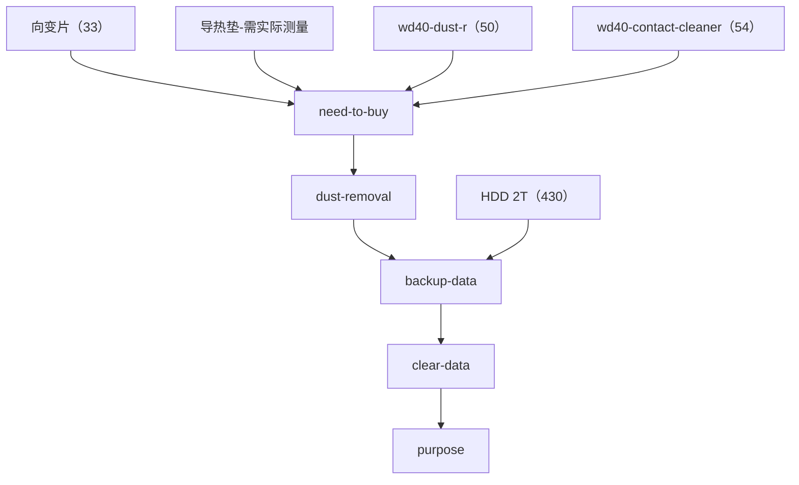
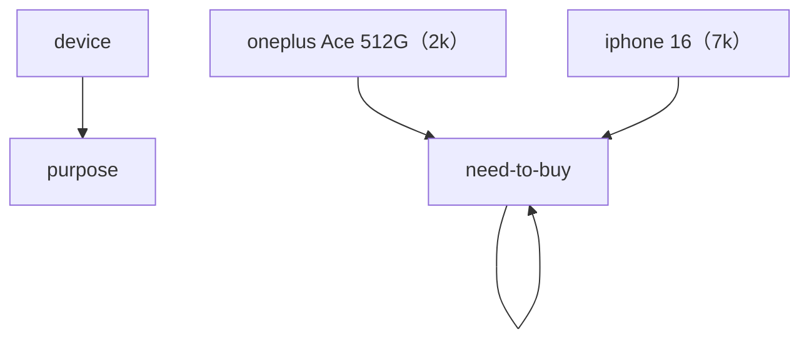

purpose：2 device stream
total: 430+33+50+54=567+50 |= 600+

```mermaid
graph TD
    A[purpose]
    B[clear-data]
    C[backup-data]
        c1[HDD 2T（430）]
    D[dust-removal]
        d1[need-to-buy]
        d2[向变片（33）]
        d3[导热垫-需实际测量]
        d4[wd40-dust-r（50）]
        d5[wd40-contact-cleaner（54）]
    
    B --> A
    C --> B
    D --> C
    d1 --> D
    d2 --> d1
    d3 --> d1
    d4 --> d1
    d5 --> d1
    c1 --> C
```

purpose: change phone
total: 2k + 7k = 9k

```mermaid
graph TD
    A[purpose]
    B[device]
        b1[need-to-buy]
        b2[oneplus Ace 512G（2k）]
        b3[iphone 16（7k）]

    B --> A
    b1 --> b1
    b2 --> b1
    b3 --> b1
```

