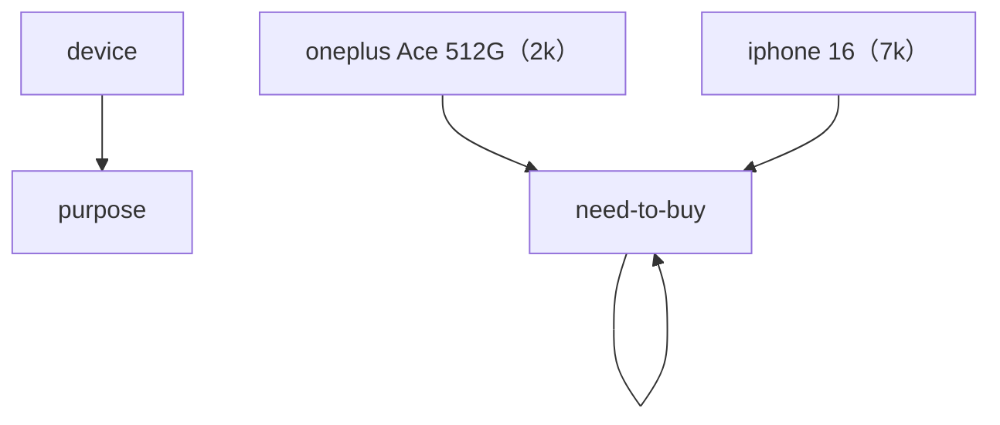

purpose: change phone
total: 2k + 4k = 6k

```mermaid
graph TD
    A[purpose]
    B[device]
        b1[need-to-buy]
        b2[oneplus Ace 512G（2k）]
        b3[iphone 16（7k）]

    B --> A
    b1 --> b1
    b2 --> b1
    b3 --> b1
```

